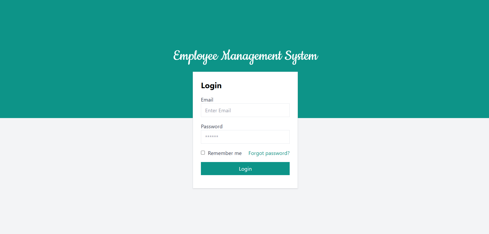
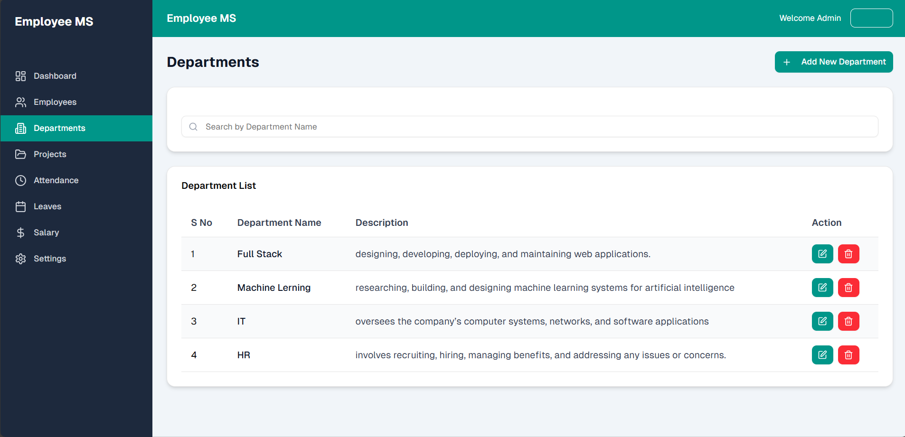
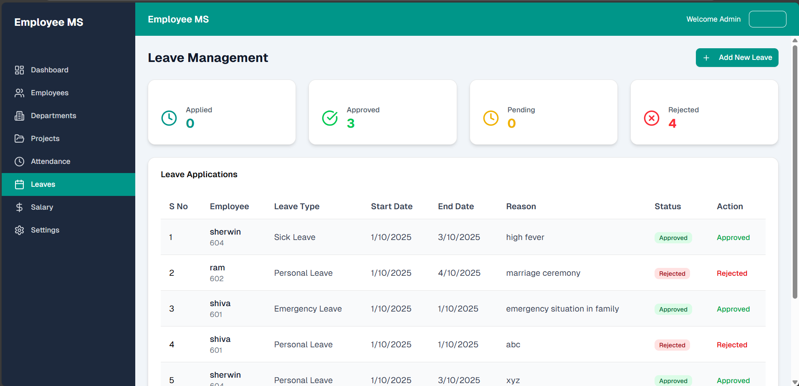
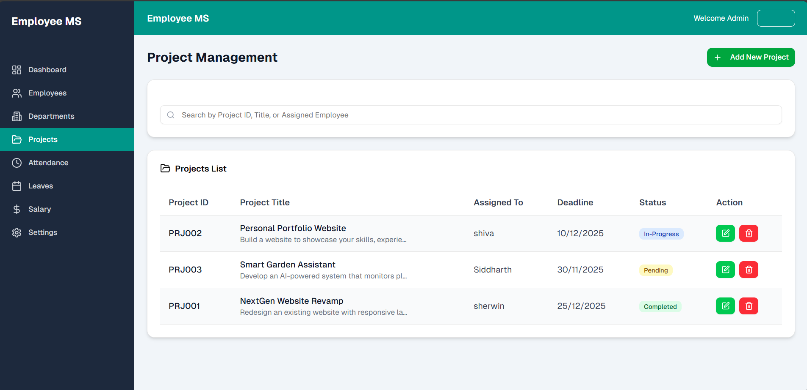
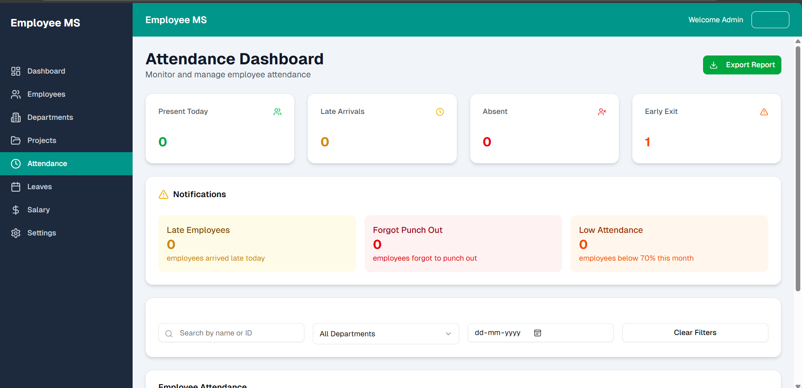
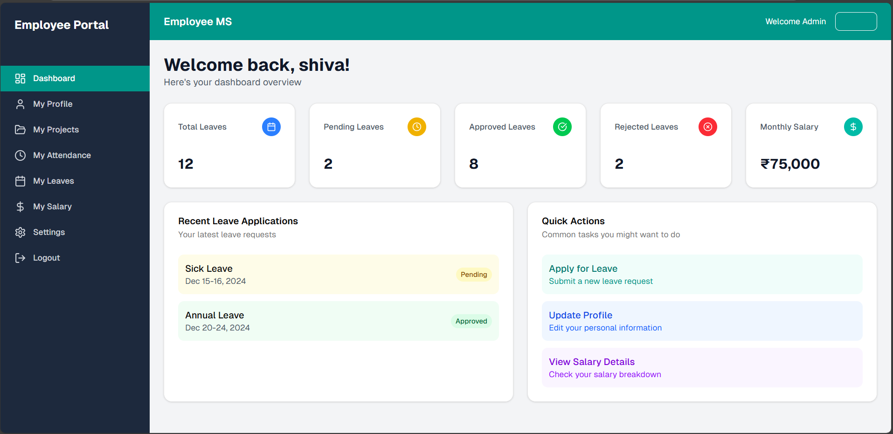
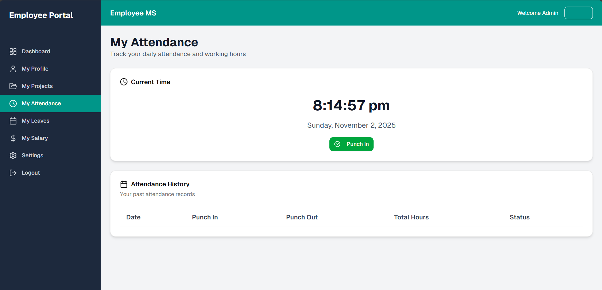

# Employee Management System

## Project Overview
The Employee Management System is a full-stack web application designed to manage employee records, departments, and leave requests within an organization. The system provides secure authentication and role-based access for administrators and employees.

## Tech Stack
Frontend:
- JavaScript
- React.js

Backend:
- TypeScript
- Node.js
- Express.js

Database:
- MongoDB

## Features
- Secure login and authentication
- Role-based access (Admin / Employee)
- Employee CRUD operations
- Department management
- Leave management module
- RESTful API architecture

## Demo Login Credentials

Admin:
- Username: admin@company.com
- Password: admin123

Employee:
- Username: employee@company.com
- Password: employee123

## Screenshots

### Login Page

### Admin Employee Section

### Admin Department Section

### Admin Leave Section

### Admin Project Section

### Admin Dashboard Section

### Employee Dashboard

### Employee Attendance Section

